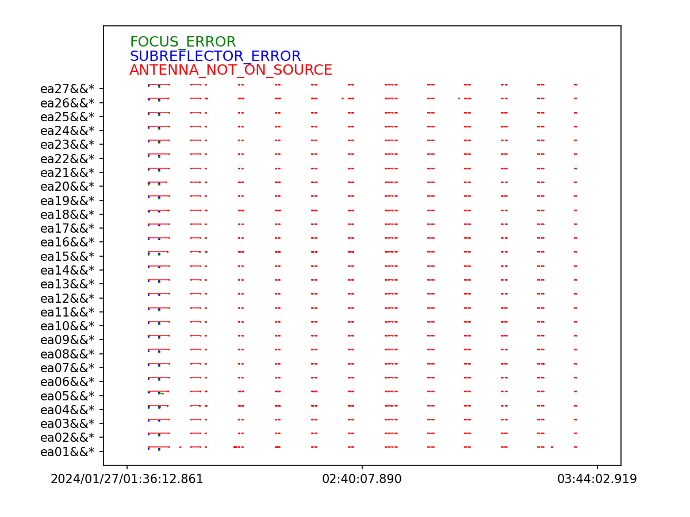

# Initial suffering (learning)

Field 0 (primary calibrator) summary

/image.png)

There is definitely a lot of scattered stuff beyond what we want. Not a huge chunk at least.

```python
plotms(vis=msname, field='0', xaxis='time', yaxis='amp', spw='16~47', coloraxis='spw')
```

Here is the automatically applied flags

```python
flagcmd(vis=msname, inpmode='table', reason='any', action='plot', plotfile='plots/flaggingreason_vs_time.png')
```



## TFcrop

Applying tfcrop with

```python
flagdata(vis=msname, mode='tfcrop', spw='16~47', datacolumn='data', action='apply', display='both', flagbackup=False)
```

/image%201.png)

Definitely removed a bit at the front, plus some scatter from non blue channels. Iteraxis on `spw` shows for field 0:

- 26, 32, [39, 40, 41], [43, 44, 45, 46, 47] has a bit of scatter above norm ~0.1 amp.
- 39, 40, 41, 43, 44 def RFI
- 45 is the one with the wide time scale stuff, bleeding into 46 and a little 47

A quick squizz at field 1 shows a ton of weird stuff in spw 39-47, probably RFI, especially later in the observations.

## Rflag

### Quick calibration

- Got error as “No offsets found”,  when using `gencal` with `antpos` assuming this means that antenna positions are correct.
- Looking for good channels in field `'1'` or `'J0321+1221'` I used a function to yoink these

```python
'16:27~29,17:17~19,18:44~46,19:25~27,20:7~9,21:18~20,22:48~50,23:42~44,24:5~7,
25:32~34,26:20~22,27:23~25,28:12~14,29:23~25,30:39~41,31:46~48,32:43~45,33:49~51,
34:55~57,35:32~34,36:54~56,37:11~13,38:21~23,39:5~7,40:20~22,41:36~38,42:28~30,
43:10~12,44:56~58,45:55~57,46:47~49,47:5~7'
```

```python
plotms(vis=msname, field='1', xaxis='channel', 
	yaxis='amp', spw='16~47', iteraxis='spw')
```

Then running the `gaincal` for the phases

```python
gaincal(vis=msname, caltable='24A-411.sb45152540.eb45209965.60336.070794328705.initPh', 
	field='1', solint='int', spw='16:25~27,17:18~19,21:1~23,22:48~50,27:14~16', 
	refant='ea24', minblperant=3, minsnr=3.0, calmode='p')
```

spw

- 16: bad antenna: ea13, ea15, ea19, ea24, ea19, ea24
`flagdata(vis=msname, mode='manual', antenna='ea13,ea15,ea19,ea24', spw='16')`
- 17: ea19, ea24
`flagdata(vis=msname, mode='manual', antenna='ea19,ea24', spw='17')`
- 18: ea02, ea24
- 19: ea02, ea18, ea24, ea25
- 20: ea06, ea10, ea24
- 21: ea06, ea08, ea11, ea17, ea20, ea24
- 22: ea16, ea23, ea24, ea25
- 23: ea03, ea12, ea24
- 24: ea03, ea05, ea17, ea25
- 25: ea22, ea24
- 26: ea24
- 27: ea02, ea07,, ea12, ea23, ea24
- 28: ea11, ea19, ea24, ea27
- 29: ea22, ea24, ea27
- 30: ea09, ea12, ea22, ea24
- 31: ea12, ea24
- 32: ea11, ea13, ea15, ea18, ea24
- 33: ea16, ea24, ea25,
- 34: ea05, ea09m ea24
- Got bored

/image%202.png)

Now we do the initial bandpass

```python
bandpass(vis=msname, caltable='24A-411.sb45152540.eb45209965.60336.070794328705.initBP',
	field='1', solint='inf', combine='scan', refant='ea24',
	minblperant=3, minsnr=10.0, gaintable='24A-411.sb45152540.eb45209965.60336.070794328705.initPh',
	interp='nearest', solnorm=False)
```

```python
plotms(vis='24A-411.sb45152540.eb45209965.60336.070794328705.initBP',
	xaxis='freq', yaxis='amp', iteraxis='antenna', coloraxis='corr',gridrows=2)
```

No points look out of place on the resulting bandpass graphs. Therefore applying to calibration with

```python
applycal(vis=msname, gaintable='24A-411.sb45152540.eb45209965.60336.070794328705.initBP/', 
	calwt=False)
```