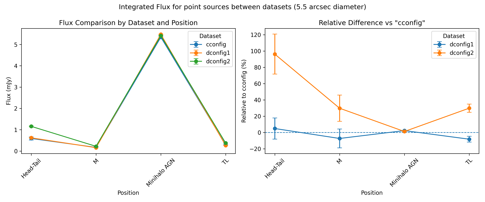
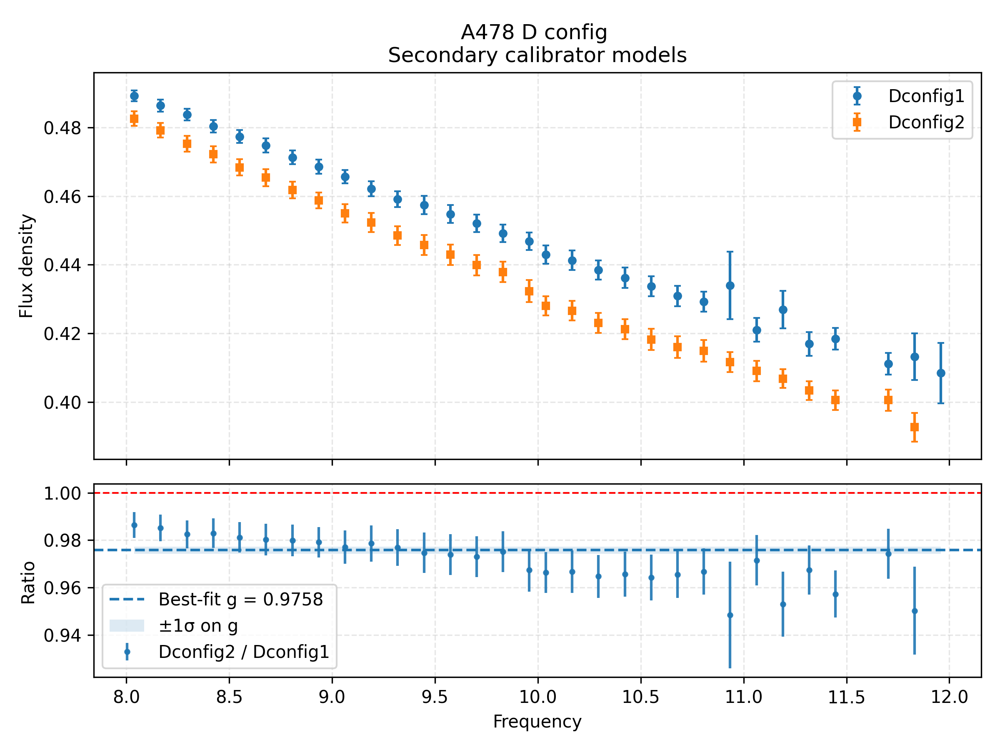
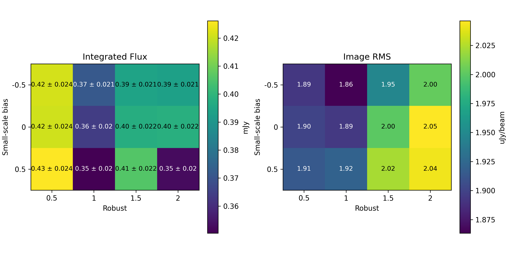
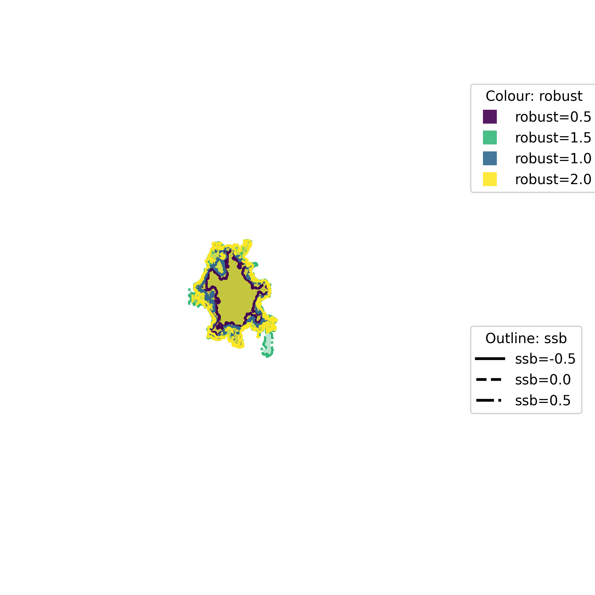
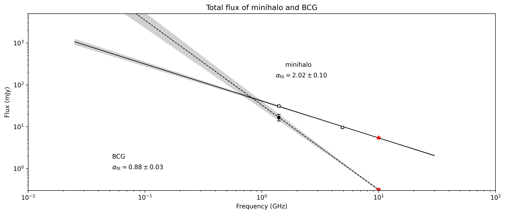
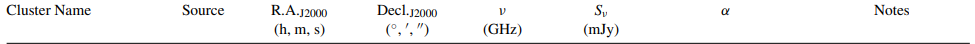
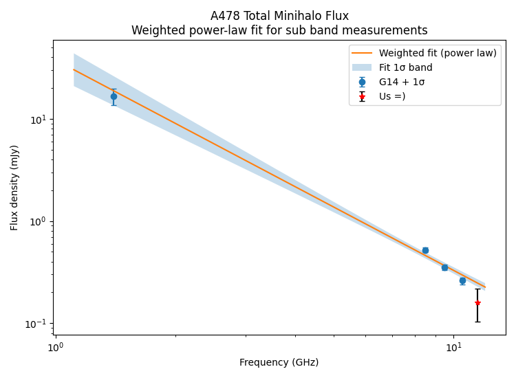
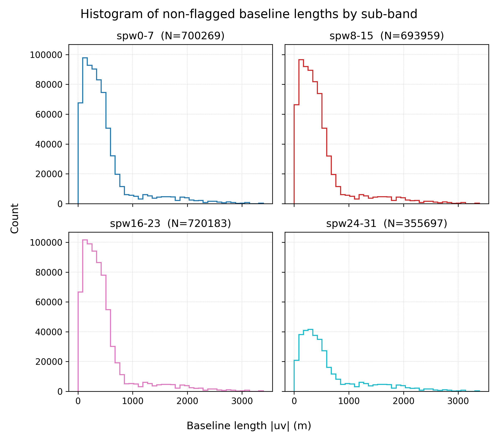
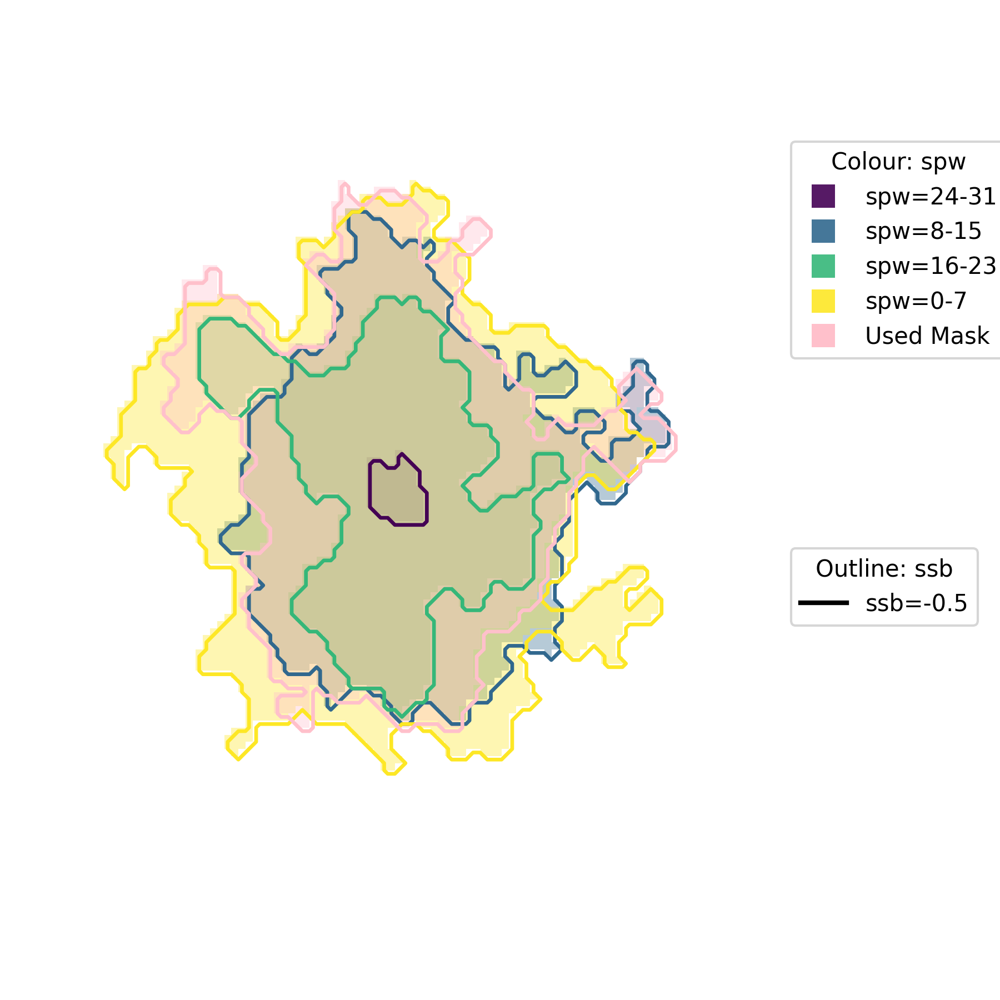
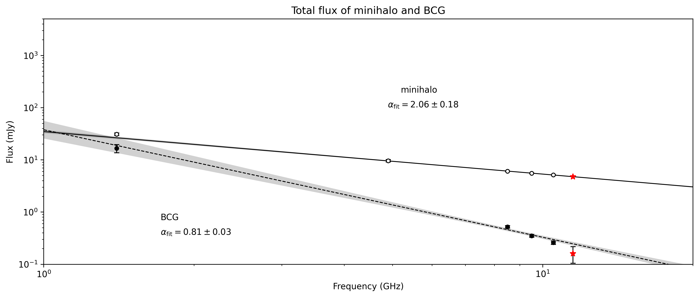

# Minihalo

Arcsec to kpc at z=0.088 using standard cosmology is ~1.66 kpc per 1“. Each cell is .5” so ~0.8 kpc. Beam resolution is ~1.8” which is 3.92 kpc. 

## Observation Data

- **cconfig** 27/1/2024
    - uvwave range  [0, 136000]
- **dconfig 1** 27/2/25
    - uvwave range [0, 35000]
- **dconfig 2** 27/3/25
    - uvwave range [0, 35000]

So 1 year between C and D configurations, 1 month between D configs.

# Checking point source fluxes

Identified following point sources as 

- Minihalo AGN (S1) `"circle[[4h13m25.29s, 10d27m54.6s], 5arcsec]"`
- Head-tail AGN (S4) `"circle[[4h13m38.37s, 10d28m08.54s], 2.5arcsec]"`
- TL (S3) `"circle[[4h13m35.25s, 10d29m21.23s], 2.5arcsec]"`
- M (S2) `"circle[[4h13m31.88s, 10d28m38.90s], 2.5arcsec]"`

Pretty big variation for the head-tail, some others, but minihalo is stable. Likely more to be variable sources?



Model discrepancy is small ~3% within calibration error here. Last parts are a bit clunky due to bad RFI in the calibration. 

The minihalo difference between dconfig datasets mirror that of the calibration, unlikely to have varied to a greater extent than calibration error. In contrast the head-tail is likely to have backflipped, since the modelling seems to not be what is causing the massive jump.



# Subtracting point sources

The head-tail is interfering with getting a good image, so trying to get a good model of this for subtraction. Also subtracting the AGN of the BCG during this process, first region is head-tail, second is AGN.

```python
IMAGE_DIR = "check_flux/images"
OUTPUT_DIR = "check_flux/masked_models"
nterms = 2
datasets = ["cconfig", "dconfig1", "dconfig2"]

regions = ["circle[[4h13m38.37s, 10d28m08.54s], 1.25arcsec]",
           "circle[[4h13m25.28s, 10d27m54.5s], 5arcsec]"]

if os.path.exists(OUTPUT_DIR):
    os.system(f'rm -r {OUTPUT_DIR}')
os.makedirs(OUTPUT_DIR)

for ms in datasets:
    original_models = [f'{IMAGE_DIR}/{ms}_checkflux.model.tt{i}' for i in range(nterms)]
    masked_models = [f'{OUTPUT_DIR}/{ms}_checkflux.model.tt{i}' for i in range(nterms)]
    for o, m in zip(original_models, masked_models):
        os.system(f'cp -r {o} {m}')
        ia.open(m)
        regs = {i: rg.fromtext(crtf, shape=ia.shape(), csys=ia.coordsys().torecord()) for i, crtf in enumerate(regions)}
        reg = rg.makeunion(regs)
        inv_reg = rg.complement(reg)
        ia.set(0.0, region=inv_reg)
        ia.close()

os.system(f'rm -r *_uvsub.ms')

for ms in datasets:
    clearcal(f'{ms}.ms')
    ft(vis=f'{ms}.ms', nterms=nterms,
       model=[f'{OUTPUT_DIR}/{ms}_checkflux.model.tt{i}' for i in range(nterms)],
       usescratch=True)
    uvsub(f'{ms}.ms')
    split(f'{ms}.ms', outputvis=f'{ms}_uvsub.ms', datacolumn='corrected')

```

The largest residual for these images was 8.87 uJy/beam from dconfig1, so we can assume error from point source subtraction of the minihalo is approximately the above as the AGN size is < beam size.

## Check subtraction

```python
tclean(vis=["cconfig_uvsub.ms", "dconfig1_uvsub.ms", "dconfig2_uvsub.ms"],
	imagename='minihalo',
	imsize=[2304, 2304], cell=['0.5arcsec','0.5arcsec'],
	specmode='mfs', niter=20000, gain=0.1, 
	threshold='0.008mJy', scales=[0, 2, 4, 8],
	deconvolver='mtmfs', pblimit=-1.e-6,
	stokes='I', weighting='briggs', robust=0.5, pbcor=False,
	usemask='auto-multithresh', noisethreshold=5, sidelobethreshold=1.25,
	lownoisethreshold=2, minbeamfrac=0.1, negativethreshold=0.0, fastnoise=False)
```

Look at using larger scales, test the mask for emission.

Try a grid search for robust, ssb. Use scales [0, 4, 8, 16]?

```python
from casatasks import tclean

OUTPUT_DIR = "grid_search"
smallscalebias = [-0.5, 0, 0.5]
robust = [0.5, 1, 1.5, 2]

for ssb in smallscalebias:
    for r in robust:
        image_name = f"{OUTPUT_DIR}/minihalo_robust{r}_ssb{ssb}"
        tclean(vis=["cconfig_uvsub.ms", "dconfig1_uvsub.ms", "dconfig2_uvsub.ms"],
            imagename=image_name,
            imsize=[2304, 2304], cell=['0.5arcsec','0.5arcsec'],
            specmode='mfs', niter=10000, gain=0.1, threshold='0.008mJy',
            deconvolver='mtmfs', pblimit=-1.e-6, scales=[0, 4, 8, 16], smallscalebias=ssb,
            stokes='I', weighting='briggs', robust=r, pbcor=False,
            usemask='auto-multithresh', noisethreshold=5, sidelobethreshold=1.25,
            lownoisethreshold=2, minbeamfrac=0.1, negativethreshold=0.0, fastnoise=False)

```





Nothing here looks particularly different and the images are all a little hit and miss. Quality of images + models biases me towards r=1, ssb=-0.5. Just need to take care from sidelobes of the head-tail or subtract more of it.

## Testing subtracting full head-tail

```python
tclean(vis=["cconfig_uvsub2.ms", "dconfig1_uvsub2.ms", "dconfig2_uvsub2.ms"],
	imagename='minihalo2',
	imsize=[2304, 2304], cell=['0.5arcsec','0.5arcsec'],
	specmode='mfs', niter=20000, gain=0.1, 
	threshold='0.008mJy', scales=[0, 2, 4, 8],
	deconvolver='mtmfs', pblimit=-1.e-6,
	stokes='I', weighting='briggs', robust=0.5, pbcor=False,
	usemask='auto-multithresh', noisethreshold=5, sidelobethreshold=1.25,
	lownoisethreshold=2, minbeamfrac=0.1, negativethreshold=0.0, fastnoise=False)
```

Actually worked really well.

# Minihalo image

Using the full-head-tail subtracted image and the robust / ssb / scales found via the grid search.

```python
tclean(vis=["cconfig_uvsub2.ms", "dconfig1_uvsub2.ms", "dconfig2_uvsub2.ms"],
	imagename='minihalo',
	imsize=[2304, 2304], cell=['0.5arcsec','0.5arcsec'],
	specmode='mfs', niter=20000, gain=0.1, 
	threshold='0.008mJy', scales=[0, 2, 4, 8, 16], smallscalebias=-0.5,
	deconvolver='mtmfs', pblimit=-1.e-6,
	stokes='I', weighting='briggs', robust=1, pbcor=False,
	usemask='auto-multithresh', noisethreshold=5, sidelobethreshold=2.5,
	lownoisethreshold=2, minbeamfrac=0.1, negativethreshold=0.0, fastnoise=False)
```

Worked well apart from the fact it cutoff part of the head in masking so interactively cleaning it up and reducing threshold to 6 uJy since residuals are 1.88 uJy/beam.

```python
tclean(vis=["cconfig_uvsub2.ms", "dconfig1_uvsub2.ms", "dconfig2_uvsub2.ms"],
	imagename='minihalo',
	imsize=[2304, 2304], cell=['0.5arcsec','0.5arcsec'],
	specmode='mfs', niter=20000, gain=0.1, 
	threshold='0.006mJy', scales=[0, 2, 4, 8, 16], smallscalebias=-0.5,
	deconvolver='mtmfs', pblimit=-1.e-6,
	stokes='I', weighting='briggs ', robust=1, pbcor=False,
	interactive=True)
```

Wideband pbcor

```python
widebandpbcor(vis="cconfig.ms", 
	imagename="minihalo", nterms=2, threshold="0.0019mJy", pbmin=0.01,
	spwlist=list(range(32)), chanlist=[2]*32, weightlist=[1.0]*21 + [0.5]*11)
```

# Minihalo flux

Which results in:

Beam size of 5.55” x 5.96”

Flux $0.310 \pm 0.029$ mJy _fit_with_band_fit_with_band

and error distribution as cal error: $10.5$ uJy, noise error: $8.67$ uJy, sub_error: $14.4$ uJy.

## Compared to G14

Making fits using the G14 values we get the following



The BCG is pretty steep, but I think makes sense since it has jet lobes? This is also slightly less steep than measured via G14 (0.94).

Same for the minihalo itself, but G14 also used the entire image which could be biasing it higher since we have detected some other things in the frame. Spectral index of -2 isn’t out of the ballpark, just definitely on the higher side.

A much larger mask (not including S1-S4), then a rough estimate doubles the flux as it includes various point sources. This doesn’t really change the fit since it’s logarithmic. 

# Notes from G14

They subtracted 4 sources, then calculated flux of full image, large error due to head-tail subtraction difficulty. 




redshift taken from https://ui.adsabs.harvard.edu/abs/1990ApJS...74....1Z/abstract (1990)

# Split sub bands

Cut into some chunks, image, see if we get ok image and flux measurements to est spectral index.

Cutting into 4 chunks, only bad chunk is dconfig1 24~31 which is almost entirely flaggged.

Then we just image each of the chunks.







Test AGN in subbands. Wideband corr can use same weights, since RFI fraction is ~const per subband.

```python
for im in ["0-7", "8-15", "16-23", "24-31"]:
    vis = f"../spw{im}/cconfig_uvsub2.ms"
    im_name = f"image_spw{im}"
    widebandpbcor(vis=vis, 
        imagename=im_name, nterms=2, threshold="0.008mJy", pbmin=0.01,
        spwlist=list(range(8)), chanlist=[2]*8, weightlist=[1.0]*8)
```

## AGN steepening

