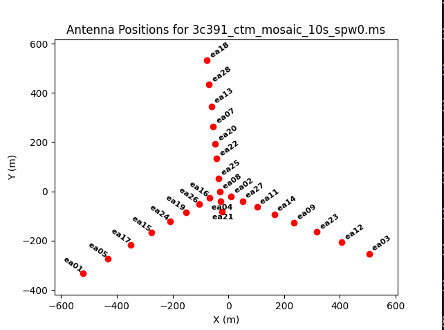
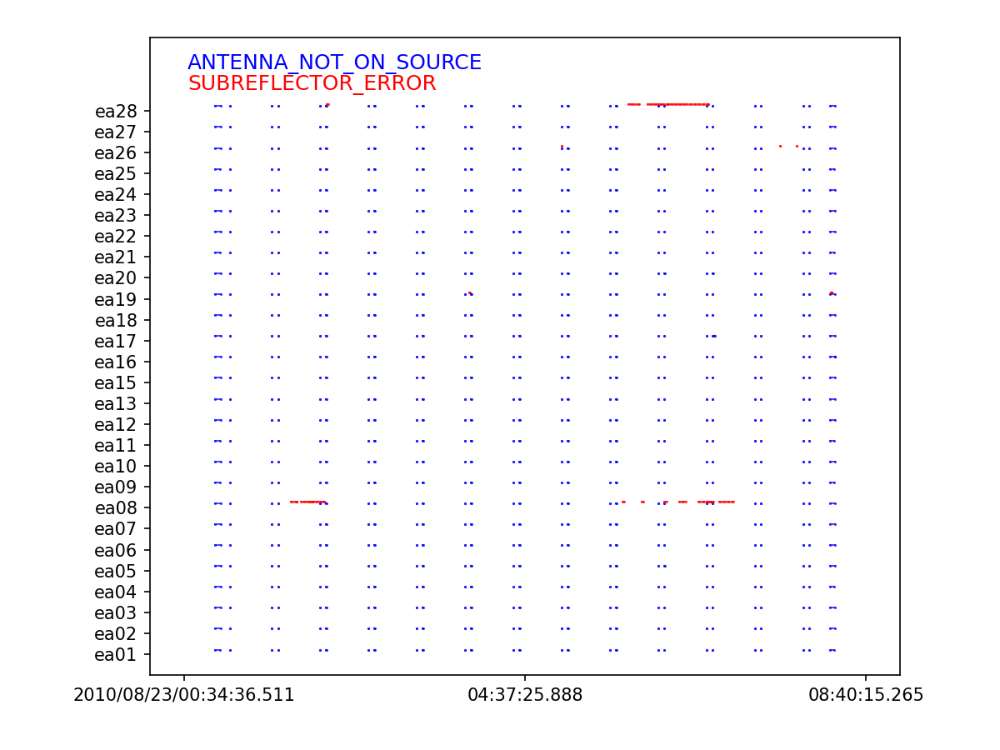

# CASA

[Install notes](CASA/Install%20notes%201b41feeec5b780eeb3a3d2bca7e15772.md)

Error about pixbuf doesn’t seem to break anything so far. Logger outputs results of tasks.

# Pre-calibration

[https://casaguides.nrao.edu/index.php/VLA_Continuum_Tutorial_3C391-CASA6.4.1](https://casaguides.nrao.edu/index.php/VLA_Continuum_Tutorial_3C391-CASA6.4.1)

## listobs(vis=file.ms)

First is summary info about measurement, including observer, date, elapsed time. 

Then each scan is listed with time range and field/location of observation. Can see the primary and secondary calibrators amongst science fields. 

Next section details fields, including declination/right ascension, id, etc.

Spectral windows note the channels that the observations were done within.

Sources links id to name

Antennas notes the antenna used for the observation and the coordinates/properties.

## clearstat()

Removes table locks generated by operations. Useful to do once done with a task.

## flagdata(vis=’file.ms’, …)

Flags data based on a variety of conditions. 

- `flagbackup`  backsup flags prior to changing, in case we want to revert the change
- `mode` means that we select ourselves.
- `scan` selects specific scans to flag. These are index 0-N, and must be entered as a string `'1'`
- `antenna` selects specific antenna to remove. Indexed either by id `'22'`, or by name `'ea23'`  note that id and name may not be the same. Can list multiple with commas.
- `mode='quack'` This flags some data at the beginning of each scan, while the dish may be settling. Can set interval with `quackinterval=10` and the location with `quackmode='beg'` .

## plotants(vis=’file.ms’, figfile=’save.png’)

Visualises the antenna array.



## plotms(vis=’file.ms’)

Visualises the amplitude over time. 

- `selectdata` boolean to skip plotting the flagged data
- `correlation` plots LL, RR, LR, RL. Can select non polarised with `“LL,RR"`
- `averagedata` averages before plotting
- `avgchannel` averages over each channel before plotting. Given as string `'64'`
- `coloraxis` sets how to color the data, `field` does by source.

We can also plot all antenna vs a reference to see when they  drop out.`plotms(vis='3c391_ctm_mosaic_10s_spw0.ms',field='',correlation='RR,LL', timerange='', antenna='ea01', spw='0:31', xaxis='time', yaxis='antenna2', plotrange=[-1,-1,0,26],coloraxis='field')`


Two masked out antenna, then 13, 6, 1 all drop out for a significant period of time. 

# Calibration

[https://casadoclinears.readthedocs.io/en/v6.5.4/notebooks/synthesis_calibration.html](https://casadocs.readthedocs.io/en/v6.5.4/notebooks/synthesis_calibration.html)

## gencal()

Create calibration tables from metadata such as antenna position offsets, gaincurves and opacities.

We can use this with to correct antenna positions if the positions were updated AFTER the observation was completed (and therefore not stored correctly during observation). 

```jsx
gencal(vis='3c391_ctm_mosaic_10s_spw0.ms',
	caltable='3c391_ctm_mosaic_10s_spw0.antpos', caltype='antpos')
```

This sets the input, output, and type of calibration. Automatically looks up the positions of antennas and saves them.

## setjy()

This sets the flux density (janskys → jy) using a primary calibrator model. We can list available models via `setjy(vis='3c391_ctm_mosaic_10s_spw0.ms', listmodels=True)` . Actually calibrating can be done with 

```jsx
setjy(vis='3c391_ctm_mosaic_10s_spw0.ms', 
	field='J1331+3030', standard='Perley-Butler 2017', 
	model='3C286_C.im', usescratch=True, scalebychan=True, 
	spw='')
```

Where `field` corresponds to the primary calibrator in our observation, and the standard and model are the stored values for the calibrator. Note that `_C` here is because our observation is C-band. The `spw` specify what spectral window to apply to, there is one in the dataset so can skip.

## gaincal()

Initial phase calibration is to be performed prior to the bandpass calibration so that time dependent effects between different scans do not impact the bandpass calibration. This initial phase calibration will later be discarded.

```jsx
gaincal(vis='3c391_ctm_mosaic_10s_spw0.ms', caltable='3c391_ctm_mosaic_10s_spw0.G0all', 
        field='0,1,9', refant='ea21', spw='0:27~36',
        gaintype='G',calmode='p', solint='int', 
        minsnr=5, gaintable=['3c391_ctm_mosaic_10s_spw0.antpos'])
```

The fields are all the primary + secondary calibrators, not just the bandpass one. The reference antenna is once located near the centre that doesn’t drop out. The spectral windows are given as 0 and 27-36, in the centre of the bandwidth. Gaintype `G`  is the complex gain. The `calmode` of `p` determines we are calibrating the phase, `solint` is the solution intergration time, `minsnr` is the signal to noise ratio. `gaintable` is the previous gain calibration tables to apply. 

We can also use

```jsx
plotms(vis='3c391_ctm_mosaic_10s_spw0.G0all',xaxis='time',yaxis='phase',
        coloraxis='corr',iteraxis='antenna',plotrange=[-1,-1,-180,180])
```

To visualise the phase differences. For a good calibration, antenna should smoothly varying over time, not flipping between two states. These antenna should be flagged.

Then we can run the actual bandpass calibration, with the field only set to the primary calibrator.

```jsx
gaincal(vis='3c391_ctm_mosaic_10s_spw0.ms', caltable='3c391_ctm_mosaic_10s_spw0.G0', 
        field='J1331+3030', refant='ea21', spw='0:27~36', calmode='p', solint='int', 
        minsnr=5, gaintable=['3c391_ctm_mosaic_10s_spw0.antpos'])
```

Then we can run the delay calibration, against a reference antenna.

```jsx
gaincal(vis='3c391_ctm_mosaic_10s_spw0.ms',caltable='3c391_ctm_mosaic_10s_spw0.K0', 
        field='J1331+3030',refant='ea21',spw='0:5~58',gaintype='K', 
        solint='inf',combine='scan',minsnr=5,
        gaintable=['3c391_ctm_mosaic_10s_spw0.antpos',
                   '3c391_ctm_mosaic_10s_spw0.G0'])
```

We can see the `refant` is set to ‘ea21’ and the channels are all but the less sensitive edges (6 either side). The `gaintype` is set to “K” for the delay calibration. `solint` of “inf” gets a single solution across all times and scans, but respects scan boundaries. `combine` with ”scan” combines all the scans into one dataset. `gaintable` uses the previous two calibrations we created.

We can visualise these delays with 

```jsx
plotms(vis='3c391_ctm_mosaic_10s_spw0.K0',
	xaxis='antenna1',yaxis='delay',coloraxis='baseline')
```

## bandpass()

This calculates the complex bandpass for the observation.

```jsx
bandpass(vis='3c391_ctm_mosaic_10s_spw0.ms',caltable='3c391_ctm_mosaic_10s_spw0.B0',
         field='J1331+3030',spw='',refant='ea21',combine='scan', 
         solint='inf',bandtype='B',
         gaintable=['3c391_ctm_mosaic_10s_spw0.antpos',
                    '3c391_ctm_mosaic_10s_spw0.G0',
                    '3c391_ctm_mosaic_10s_spw0.K0'])
```

The `solint` is again “inf”, with `combine` set to “scan”. The `bandtype` is “B”, for a per channel basis.

The following commands plot the complex amplitude and phase.

```jsx
plotms(vis='3c391_ctm_mosaic_10s_spw0.B0',field='J1331+3030', 
        xaxis='chan',yaxis='amp',coloraxis='corr',
        iteraxis='antenna',gridrows=2,gridcols=2)

plotms(vis='3c391_ctm_mosaic_10s_spw0.B0',field='J1331+3030', 
        xaxis='chan',yaxis='phase',coloraxis='corr',plotrange=[-1,-1,-180,180], 
        iteraxis='antenna',gridrows=2,gridcols=2)
```

## gaincal(), but for real

The initial phase calibration was so that we could create a good bandpass. We can now calculate the final gaincal and ignore the original one.

```jsx
gaincal(vis='3c391_ctm_mosaic_10s_spw0.ms',caltable='3c391_ctm_mosaic_10s_spw0.G1',
        field='J1331+3030',spw='0:5~58',
        solint='inf',refant='ea21',gaintype='G',calmode='ap',solnorm=False,
        gaintable=['3c391_ctm_mosaic_10s_spw0.antpos',
                   '3c391_ctm_mosaic_10s_spw0.K0',
                   '3c391_ctm_mosaic_10s_spw0.B0'],
        interp=['','','nearest'])
```

The main differences are that we use `spw` in the widest range we can, skipping the edges found from the bandpass. The `calmode` is set to `ap`  to find both amplitude and phase. Then, the delay and bandwidth corrections are applied in the gain table. The last argument `interp` refers to interpolating for time in the case of multiple bandpass solutions.

This only uses the primary calibrator, so we do a second pass with `append=True` so that there is a single calibration. This is identical apart from the fields used. 

```jsx
gaincal(vis='3c391_ctm_mosaic_10s_spw0.ms',caltable='3c391_ctm_mosaic_10s_spw0.G1',
        field='J1822-0938',
        spw='0:5~58',solint='inf',refant='ea21',gaintype='G',calmode='ap',
        gaintable=['3c391_ctm_mosaic_10s_spw0.antpos',
                   '3c391_ctm_mosaic_10s_spw0.K0',
                   '3c391_ctm_mosaic_10s_spw0.B0'],
        append=True)
```

This then plots all the solutions found

```jsx
plotms(vis='3c391_ctm_mosaic_10s_spw0.G1',xaxis='time',yaxis='phase',
       gridrows=1,gridcols=2,iteraxis='corr',coloraxis='baseline',
       plotrange=[-1,-1,-180,180],plotfile='plotms_3c391-G1-phase.png')
plotms(vis='3c391_ctm_mosaic_10s_spw0.G1',xaxis='time',yaxis='amp',
       gridrows=1,gridcols=2,iteraxis='corr',coloraxis='baseline',
       plotfile='plotms_3c391-G1-amp.png')
```

The phase stability of the reference antenna canclean be assessed via the following code. This is acceptable if is it has minimal drift in time.

```jsx
plotms(vis='3c391_ctm_mosaic_10s_spw0.G1', xaxis='time', yaxis='phase',
        correlation='/', coloraxis='baseline', plotrange=[-1,-1,-180,180])
```

We know the flux of the primary calibrator by definition, but not that of the secondary. We can find this by assuming the gains are the same between the two and creating a flux scale. This transfers the scale onto the secondary calibrator.

```jsx
myscale = fluxscale(vis='3c391_ctm_mosaic_10s_spw0.ms',
                    caltable='3c391_ctm_mosaic_10s_spw0.G1', 
                    fluxtable='3c391_ctm_mosaic_10s_spw0.fluxscale1', 
                    reference='J1331+3030',
                    transfer=['J1822-0938'],
                    incremental=False)
```

Can then check values against the VLA calibrator manual to make sure it isn’t order of magnitude off. Expects 50-100% off on timescales of months and year. 

Rescaled plotting

```jsx
plotms(vis='3c391_ctm_mosaic_10s_spw0.fluxscale1',xaxis='time',yaxis='amp',
       correlation='R',coloraxis='baseline')
plotms(vis='3c391_ctm_mosaic_10s_spw0.fluxscale1',xaxis='time',yaxis='amp',
       correlation='L',coloraxis='baseline')
```

# cleanApplying calibrations

## applycal()

This applies the calibration to the specified field and has a pipeline with the associated `gainfield` and `interp` arguments for the `gaintable` values. For the calibrators we need use the correct gainfield. 

```jsx
applycal(vis='3c391_ctm_mosaic_10s_spw0.ms',
         field='J1822-0938',
         gaintable=['3c391_ctm_mosaic_10s_spw0.antpos', 
                    '3c391_ctm_mosaic_10s_spw0.fluxscale1',
                    '3c391_ctm_mosaic_10s_spw0.K0',
                    '3c391_ctm_mosaic_10s_spw0.B0'],
         gainfield=['','J1822-0938','',''], 
         interp=['','nearest','',''],
         calwt=False)
```

Here we are doing the secondary calibrator. We need to specify the antenna position, fluxscale, parallactic correction, and bandpass.

When we do the science fields, we use the nearby secondary calibrator and apply to all applicable fields.

```jsx
applycal(vis='3c391_ctm_mosaic_10s_spw0.ms',
         field='2~8',
         gaintable=['3c391_ctm_mosaic_10s_spw0.antpos', 
                    '3c391_ctm_mosaic_10s_spw0.fluxscale1',
                    '3c391_ctm_mosaic_10s_spw0.K0',
                    '3c391_ctm_mosaic_10s_spw0.B0'],
         gainfield=['','J1822-0938','',''], 
         interp=['','linear','',''],
         calwt=False)
```

We can then check data looks good with `plotms` 

```jsx
plotms(vis='3c391_ctm_mosaic_10s_spw0.ms',field='0',correlation='RR,LL',
       antenna='',avgtime='60',xaxis='channel',yaxis='amp',
       ydatacolumn='corrected',coloraxis='corr',
       plotfile='plotms_3c391-fld0-corrected-amp.png')
```

## split()

Now we separate out the calibrated data into a new `.ms` file.

```jsx
split(vis='3c391_ctm_mosaic_10s_spw0.ms',outputvis='3c391_ctm_mosaic_spw0.ms',
      datacolumn='corrected',field='2~8',correlation='RR,LL')
```

This is much easier and smaller to play with.

## statwt

This corrects the weights and sigma in the data set for relative noise introduced by flagging.

# Image visualisation

We can figure out how big the image needs to be from the maximum baseline. The following code plots against UVwave, measured in wavelengths. Then using small angle approximation $\theta \approx \lambda/D$ the maximum distance is $D = 16000\lambda$ so $\theta_{min} = 1/16000$ which is $\theta_{min} \approx 12 \>\text{arcseconds}$. Then you want 4-5 pixels for a minimum resolution element so $12/5 = 2.4$ and we can just use $2.5$ as close enough and more easily multipliable. 

```jsx
plotms(vis='3c391_ctm_mosaic_spw0.ms',xaxis='uvwave',yaxis='amp',
       ydatacolumn='data', field='0',avgtime='30',correlation='RR',
       plotfile='plotms_3c391-mosaic0-uvwave.png',overwrite=True)
```

Then to get the total image size, if our total diameter is $\approx 9\>\text{arcminutes}$ then total pixels are $9\times60 / 2.5 = 216$. It’s most efficient to have a number that is $2^x \times 3 \times 5$ which in our case is 480. This means the padding of $1.2$ gives $2^{x+1} \times 3^2$.

## tclean()

The tclean runs the cleaning algorithm. Interactive mode great for the start investigation.

```bash
tclean(vis='3c391_ctm_mosaic_spw0.ms',imagename='3c391_ctm_spw0_multiscale',
      field='',spw='',
      specmode='mfs',
      niter=20000,
      gain=0.1, threshold='1.0mJy',
      gridder='mosaic',
      deconvolver='multiscale',
      scales=[0, 5, 15, 45], smallscalebias=0.9,
      interactive=True,
      imsize=[480,480], cell=['2.5arcsec','2.5arcsec'],
      stokes='I',
      weighting='briggs',robust=0.5,
      pbcor=False,
      savemodel='modelcolumn')
```

The `specmode` of ‘mfs’ means the multi frequency spectrum adjusts the u-v space for frequency variations. Gain and threshold is set for the CLEAN algorithm to pick up emissions. Use ‘mosaic’ for `gridder` since this is a mosaic image (not like my data). `niter` set real high for interactive mode. `scale` is set on order of the primary beam pixels and 3x, 9x. `imsize` set to what we found earlier. `pbcor` means we don’t correct for primary beam noise, can do that at end. `savemodel` saves to scratch column. 

Left click creates zoom region with double click in = zooming, out = unzooming. Right click creates search regions for emissions, double click in = confirm, out = cancel. Can erase regions. The green circle means run for a bit then back in interactive. The arrow means run til done. Can change the colour display by click-dragging middle mouse button. 

# Flagging

https://casaguides.nrao.edu/index.php/VLA_CASA_Flagging-CASA6.5.4

https://science.nrao.edu/science/meetings/2016/vla-data-reduction/EVLAWorkshop_RFI_2016_UR.pdf

In the new dataset, there are some additional “ScanIntent” flags.

- CALIBRATE_PHASE, primary calibrator for amplitude + phase
- OBSERVE_TARGET, science field
- CALIBRATE_AMPLI, secondary calibrator for flux scale
- CALIBRATE_BANDPASS, bandpass calibrator

We can use `plotms` to quickly look at all the data amplitudes over time.

```bash
plotms(vis='SNR_G55_10s.ms', field='1', 
	xaxis='time', yaxis='amp', coloraxis='spw')
```


This very clearly shows radio frequency interference (RFI) in a bunch of places. You can compare to known sources here [https://science.nrao.edu/facilities/vla/docs/manuals/obsguide/modes/rfi](https://science.nrao.edu/facilities/vla/docs/manuals/obsguide/modes/rfi).

We can look at the observer logs to investigate conditions https://www.vla.nrao.edu/cgi-bin/oplogs.cgi, to figure out if we need to correct antenna position, flag antenna, etc.

On download of data we can choose to apply or save the online flags. We can visualise these via the `flagcmd`

```bash
flagcmd(vis='SNR_G55_10s.ms', inpmode='table', 
	reason='any', action='plot', plotfile='flaggingreason_vs_time.png'
```



We can then apply these via the same command, but `action='apply'`

```bash
flagcmd(vis='SNR_G55_10s.ms', inpmode='table', 
	reason='any', action='apply', flagbackup=False)
```

*Note there are a few errors for missing (pre-flagged) antenna*

## Antenna shadowing

When close together, antenna can physically block eachother when observing at low declination. D and C configurations are most affected. https://science.nrao.edu/facilities/vla/docs/manuals/obsguide/dynsched/antenna-shadowing gives more information.

Can automatically flag shadowed data using 

```bash
flagdata(vis='SNR_G55_10s.ms', mode='shadow', tolerance=0.0, flagbackup=False)
```

With a tolerance for how much shadowing there is.

## Zero-amplitude / clipping

Antenna can occasionally output 0 amplitude data, use `mode=clip` to get around this. `clipzeros=True` means 0 is included in the lower limit.

```bash
flagdata(vis='SNR_G55_10s.ms', mode='clip', clipzeros=True, flagbackup=False)
```

## Quacking

Remove some at the start of a scan to reduce any dish movements from settling.

```bash
flagdata(vis='SNR_G55_10s.ms', mode='quack', 
quackinterval=5.0, quackmode='beg', flagbackup=False)
```

## Saving flags

If we want to save a flag data state, we can export it with `flagmanager` this allows us to revert or select different flagging states easily.

```bash
flagmanager(vis='SNR_G55_10s.ms', mode='save', versionname='after_online_flagging')
```

Restoring to this state is as easy as

```bash
flagmanager(vis='SNR_G55_10s.ms', mode='restore', versionname='after_online_flagging')
```

## Hanning Smoothing

Strong RFI can create Gibbs phenomenon. In the frequency space, this corresponds to being bandlimited or passing through a low-pass filter. In the time domain, this is due to rippling in the sinc function which represents a low-pass filter. 

In neighbouring regions to a sharp transition, there is an error. This is made narrower by more frequencies but NOT smaller. The following shows this for a square signal as modelled by two numbers of harmonics.


We can remove amplitude spikes by applying hanning smoothing, which removes amplitudes spikes. 

**Important: It reduces spectral resolution by factor 2 and is not suited for spectral analysis of strong/narrow peaks (since it gets rid of them)**

```python
hanningsmooth(vis='SNR_G55_10s.ms', 
	outputvis='SNR_G55_10s-hanning.ms', datacolumn='data')
```

Since it reduces RFI by splitting it into more channels, it both will reduce the number of channels that may look bad and also cause neighbouring channels to also be flagged. 

## TFcrop

This algorithm detects outliers in the time-frequency plane and can operate on **uncalibrated** data. This iterates and searches for 

1. Short duration RFI spikes (narrow + broadband)
2. Time-persistent RFI
3. Time-persistent, narrow-band RFI
4. Low-level wings of very strong RFI

Usually best to look at how it affects a small subset before applying to the full data. You can set `display='both'` and `action='calculate'` to display flags without saving them. 

```python
flagdata(vis='SNR_G55_10s-hanning.ms', mode='tfcrop', spw='0',
         datacolumn='data', action='calculate',
         display='both', flagbackup=False)
```

This means you can iterate through baselines, fields, and scans in order to compare the flagged data to the pre-flagged data. 

The basic process for each baseline is

1. Average visibility amplitudes across time to get an average spectrum. 
2. Fit a piecewise polynomial to the base to calculate the band-shape
3. Flag points deviating from the fit by more than N-sigma. 

Options to modify this

- `ntime` is the time range for each chunk, options are `'scan'`, `'2.0min'`, `120.0`
- `combinescans` is a boolean to combine scans if `ntime` > scan length
- `datacolumn` is the data to check
- `correlation` is how to correlate data
- `timecutoff` and `freqcutoff` is the scale factor N
- `timefit` and `freqfit` is the fit to apply either `'line'` or `'poly'`
- `maxnpieces` is the maximum piecewise parts of the polynomial
- `usewindowstats`, `halfwin` let you use sliding window statistics like `'std'` and `'sum'`
- `flagdimension` is the direction to calculate `'timefreq', 'time', 'freq'`

## Flag summary

Can get a summary of the flagged data by running 

```python
flagInfo = flagdata(vis='SNR_G55_10s-hanning.ms', mode='summary')
```

Can then extract different statistics, like source flagged percent

```python
flagInfo['field']['G55.7+3.4']['flagged'] / flagInfo['field']['G55.7+3.4']['total']
```

or spw flagged percent 

```python
flagInfo['spw']['0']['flagged'] / flagInfo['spw']['0']['total']
```

## rflag

This uses sliding window RMS filters to detect outliers. There are two types of analysis performed

### Time analysis (for each channel)

1. Calculate local RMS of real and imag visibilities within a sliding time window
2. Calculate the median RMS across time windows, deviations of the local RMS from the median, and the median deviation.
3. Flag if local $RMS > N(med_{RMS} + med_{dev})$

### Spectral analysis (for each timestep)

1. Calculate average of real and imaginary visibilities and RMS across channels
2. Calculate deviation of channel from average and the median deviation
3. Flag if $dev > N med_{dev}$

Arguments

- `ntime` is the time range for each chunk, options are `'scan'`, `'2.0min'`, `120.0`
- `combinescans` is a boolean to combine scans if `ntime` > scan length
- `datacolumn` is the data to check
- `correlation` is how to correlate data
- `winsize` is the size of the sliding time window
- `timedev`, `freqdev` is the _-series noise estimate given as `[[field, spw, noise_estimate]]`
- `timedevscale`, `freqdevscale` is the threshold scaling for each series
- `spectralmin` , `spectralmax` are settings to flag the whole spectrum if `freqdev` is outside of the bounds

We can run this just like the previous command

```python
flagdata(vis='SNR_G55_10s-hanning.ms', mode='rflag', spw='0', datacolumn='corrected', 
         freqdevscale=2.5, timedevscale=3.5, action='apply', display='both', 
         flagbackup=False)
```

This needs to be run on **calibrated data** and it also assumes your signal < noise since it clips data. One way to do this is by subtracting a model spectrum from the data and then running rflag on the remainder. 

1. `uvsub(vis=msname)` (subtracts model column from calibrated data)
2. Run rflag until happy
3. `uvsub(vis=msname, reverse=True)` (adds model column to calibrated data)
4. Can then recalibrate to see if results are better.

A model can be added to secondary calibrators from the fluxscale results.

## extend()

We can also run the extend function following the previous flagging operations, which will extend flagging across an axis if it is already mostly flagged. We can extend across polarisation, to make sure all data for a time and channel is flagged for each polarisation. 

We can also flag a time or channel with `growtime` and `growfreq` and a percentage value to use.

- `ntime` is the time range for each chunk, options are `'scan'`, `'2.0min'`, `120.0`
- `combinescans` is a boolean to combine scans if `ntime` > scan length
- `extendpols` Extends accross all correlations
- `growtime`, `growfreq` flag all of the timerange `ntime` or channels in SPW if more than X% is flagged.
- `growaround` on the 2D time/freq plane if more than 4 surrounding points are flagged, flag it
- `flagneartime`, `flagnearfreq` flag the points before and after every flagged point in the axis.