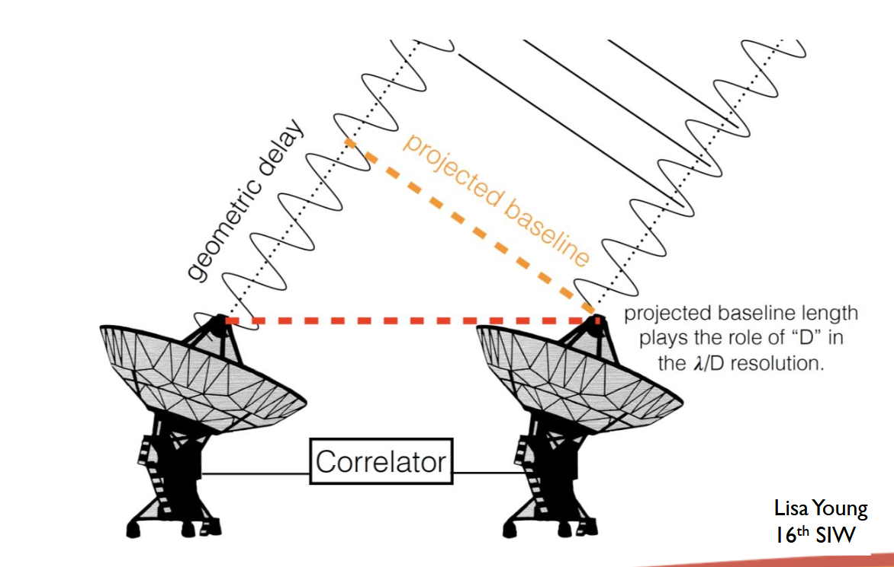
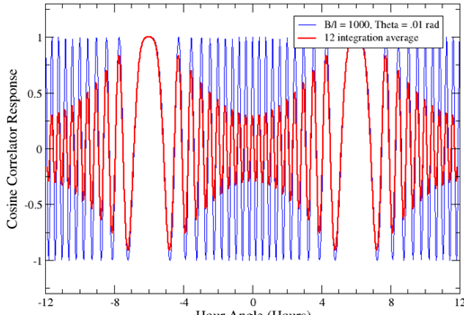

# Interferometers

Multiple dishes work together to increase resolution. Dish size determines the primary beam, while separation determines synthesized beam. There is a geometrical delay between signals, which the projected baseline is corrected for.

These projected baselines are sampled in the u-v plane and can be Fourier transformed into an actual image. The configuration of dishes is labelled A-D, with A having greatest angular resolution, lowest surface brightness resolution, D having the inverse.

## Antennas

Definitions

- Effective collection area $A(\nu, \theta, \phi)$ is a function of angles and the input frequency.
- On-axis response (gain) $A_0 = \eta A$ where $\eta$ is the aperture efficiency.
- Normalised pattern, or primary beam, is $\mathbf A(\nu, \theta, \phi) = A(\nu,\theta,\phi)/A_0$
- Beam solid angle, field of view, solid angle is $\Omega_A= \iint_{sky}\mathbf A(\nu,\theta,\phi)d\Omega$
- $A_0\Omega_A = \lambda^2$, Effective area and solid angle is a trade off

Antennae measure a voltage that is a function of the power and geometric delay. $R_C = P\cos(\omega\tau_g)$ with $R_C$ the collected response, $P = E^2/2$ the power and $\tau_g$ the time delay between antennae. 

The response of an extended source of an antenna is the spatial integral of the electric field over the primary beam $V = \iint E(\vec s) d\Omega$. The correlator response of two antennae is then $R_C = \langle \iint E_1(\vec s) d\Omega_1 \times \iint E_2(\vec s)_d\Omega_2\rangle$, which can be rearranged as $R_C = \iint I_\nu (\vec s)\cos(2\pi \nu \vec b \cdot \vec s / c) d\Omega$. Which is the spatial integration of the product of the brightness $I_\nu$ and the co-sinusoidal interferometer pattern.

From that equation we can also see that larger baselines result in smaller/more fringes, while short baselines make larger/less fringes. 

The cosinusiodal pattern only collects the even part of the overall brightness function since the cosine will cancel the odd parts. So we add a sine correlator to capture the odd parts, but cancels the even parts. 

Using both of them gives a complex correlator with $V = R_C - iR_S =Ae^{-i\phi}$. Then we can write

$$
V_\nu(\vec b) = R_C - iR_S = \iint I_\nu(\vec s) e^{-2\pi i \nu \vec b\cdot\vec s / c}\>\>d\Omega
$$

Which looks like a 2-D Fourier Transform. 

The complex visibility amplitude $A$ is independent of the source location, but linearly related to the source flux density. Similarly the complex visibility phase $\phi$ is independent of the source flux density, but a function of the source location.

Then an interferometer makes one measure of this visibility at a baseline coordinate $(u, v)$. A sufficient number of these measurements then gives a reasonable estimate of the source brightness.

### Correcting for real life

**Directional Gain**

The antenna has it’s own directional gain pattern that we can describe as $A(\vec s_0, \vec s)$ for some general direction $\vec s$ and the pointing direction $\vec s_0$. This can be easily added into the voltage formulation as

$$
V_\nu(\vec b) = \iint A_1(\vec s_0, \vec s) A_2^*(\vec s, \vec s_0)I_\nu(\vec s) e^{-2\pi i \nu \vec b\cdot\vec s / c}\>\> d\Omega
$$

Where $A_1, A_2$ are the complex (amplitude + phase) gain patterns for the antennas. The non-exponential term is then a modified view of the sky brightness.

**Finite bandwidth**

We also don’t measure a single wavelength $\lambda$, since our bandwidth is a finite, nonzero value. Since our fringe separation $B/\lambda$ is the sum of the $\Delta\lambda$ bandwidth, or measured result isn’t a clean curve. The centre is fine since all fringes are maximal at $n=0$, but get progressively more errors as $n$ increases. A visual representation of three wavelengths interfering, which starts to look like a wave packet. 

The voltage function is then further modified to be the integral over the frequency response $G(\nu)$ over the bandwidth centered at $\nu_0$ and width $\Delta\nu$. 

$$
V_\nu(\vec b) =\iint \frac1{\Delta\nu} \left(\int_{\nu_0-\Delta\nu/2}^{\nu_0-\Delta\nu/2}I(\vec s, \nu) G_1(\nu)G^*_2(\nu)e^{-2\pi i \nu \vec b\cdot\vec s / c}\>\> d\nu\right)d\Omega
$$

Where again, $G_1, G_2$ are the responses of the individual antennae. Assuming source intensity is constant over the bandwidth $I(\vec s, \nu) \in [\nu_0-\Delta\nu/2, \nu_0+\Delta\nu/2] = I_{\nu_0}(\vec s) = I_{\nu}(\vec s)$ and the gain parameters are square (or rectangular = 1) and real. Note we can also use $\tau_g = \vec b \cdot \vec s / c$ as the geometrical delay between the two antennae.

$$
V_\nu(\vec b) =\iint I_\nu(\vec s)\frac{\sin(\pi\tau_g\Delta\nu)}{\pi\tau_g\Delta\nu}e^{-2\pi i \nu \tau_g}\>\>d\Omega
$$

The fringe attenuation function is the $\text{sinc}(x) = \frac{\sin(\pi x)}{\pi x}$ which die at $x = \pm n$. This means that the attenuation effectively limits the resolution since it reduces the visibility amplitude. 

Since each baseline will strongly attenuate the amplitudes not on the meridional plane, and since each baseline has its own plane, our collection of baselines is strongest at the zenith. In order to observe not on the zenith, it’s best to shift the central fringe. We can do this by adding a time delay to the signal, effectively causing a phase shift. The shift can be found by $\sin\theta = c\tau_g/b$, which causes our initial measured correlation voltage to be $V = \langle V_1 V_2^*\rangle = E^2e^{-i\omega(t - \tau_g)}e^{i\omega(t - \tau_0)} = E^2e^{-i\omega(\tau_o-\tau_g)}$. 

We still have the co-sinusoidal pattern reducing fringes not on zenith, but removing (green) or adding (blue) delay shifts the fringe pattern.

**Rotating platform**

The interferometers are built on the earth, which is moving with regards to the source. We can keep the fringe location pointing to the source by constantly updating the time delay. Doing this frequently enough so that there is minimal bandwidth loss is important, timescales $\delta \tau \frac1{10\Delta\nu}$ are usually sufficient. Unfortunately, this does not account for the source moving within the fringe pattern itself, since the delay insertion isn’t continuous.

The ‘natural fringe rate’ given by earth’s rotation is $\nu_f = u\omega_e\cos\delta$ with $u = B/\lambda$ the E-W baseline in wavelengths, $\omega_e$ the angular rotation rate of the earth. This doesn’t contain useful information, since it’s just the platform rotating, so we don’t want to store additional information because of this. 

We can fix this by updating the phase more frequently than the delay itself. The tracking delay $\nu_d$ and the tracking fringe $\nu_f$ can be estimated as the following. $\nu_f$ can be orders of magnitude higher than $\nu_d$.

$$
\begin{align*}
\nu_d &>> \frac{\Delta\nu}{\nu}\frac B\lambda\omega_e\cos\delta\\
\nu_f&>>\frac B\lambda\omega_e\cos\delta
\end{align*}
$$

This eliminates the fringe rate for a single point in the sky, but surrounding points still have a time differential rate. This means that time averaging has an enforced limit due to this. The coherence pattern has a spacing $\lambda/B$, so the time for a source to move by this spacing is $t = \frac\lambda B \frac1{\omega_e\theta}$ where $\theta$ is the offset from the centre. At the edge of the beam $\theta = \frac\lambda D$ so $t = \frac DB \frac1{\omega_e}$.

Averaging for times comparable to the above will cause delay losses, where the visibility amplitude is attenuated. 

**Down Conversion**

Since we measure in the RF, and RF components are pricy, usually we down convert into lower frequency IF bands. This particular transition has minimal loss of information. Changes the final phase since down conversion occurs before time delay processing.

### Geometry of the measurements

For 2D measurement plane, the measurements $V_\nu(\vec b)$ then the components of $\vec b / \lambda$ are mapped to $(u, v, w) \rightarrow (u, v, 0)$. The unit direction vector $\vec s = (l,m,n) = (l, m, \sqrt{1 - l^2 - m^2})$, which are direction cosines. 

Then we can write $\vec b = (\lambda u, \lambda v, 0)$ and $\vec s = (\cos\alpha, \cos\beta, \cos\theta)$, resulting in $\vec b \cdot \vec s / \lambda = ul + vm$. Furthermore the generic function becomes

$$
V_\nu(u, v) = \iint I_\nu(l, m)e^{-i2\pi(ul + vm)}\>\>dldm
$$

Which is a 2D Fourier transform between the intensity and the visibility functions.

$$
I_\nu(l, m) = \iint V_\nu(u, v)e^{i2\pi(ul + vm)}\>\>dudv
$$

This can be used for interferometers whose baselines lie along a plane. 

**General coordinate system**

We can extend this for a general system by letting $w$ point towards the source, $u$ point towards East, and $v$ towards North. Then $l$ and $m$ increase to the east and the north. $w$ is now a representation of the delay distance. The general equation is 

$$
V_\nu(u, v, w) = \iint I_\nu(l, m) e^{-i2\pi[ul+vm+w(\sqrt{1 - l^2 - m^2}-1)]}dldm
$$

The last term can be approximated to $w(\sqrt{1 - l^2 - m^2}-1) \approx w\frac{\theta^2}2$ where $\theta$ is the offset to the map edge, and $w$ is the depth of the sampled volume in wavelengths. 

This can be ignored if the term is small enough, i.e within the primary beam $\theta_{max} = \frac\lambda D$, and depth within a fringe $w_{max} = \frac B\lambda$ so that the Clark condition is fulfilled $\frac{\lambda B}{D^2} < 1$.

### Solutions for non-coplanar arrays

1. 3D transform
The correct solution, the sky image is on a sphere of unit radius.
No practical as the final 3D cube is mostly empty (inefficient)
2. If instantaneously coplanar, then sum up snapshots
Need to re-project each image’s coordinates
3. Facetted imaging
Partitions images into little ones which have small angles. Need to do phases offset + recompute baselines for each facet.
4. Project onto the $w=0$ plane
Effectively makes it fully coplanar

## The U-V plane

Earth based coordinate grid to describe the antenna positions. 

- $X$ points to $H=0, \delta=0$, the intersection of meridian and celestial equator
- $Y$ points to $H=-g, \delta =0$, east on the celestial equator.
- $Z$ points to $\delta = 90$, the north celestial pole (NCP)

Then $B$ is described interms of components along the equatorial plane $B_x, B_y$ and along the rotation axis $B_z$. These are measured in wavelengths and constant through time (unless the earth explodes).

The relation to $(u, v, w)$ from this coordinate system is then

 

$$
\begin{pmatrix}
\vec u\\ \vec v \\ \vec w
\end{pmatrix} = \begin{pmatrix}
\sin H_0 & \cos H_0 & 0 \\
-\sin \delta_0 \cos H_0 & \sin\delta_0\sin H_0 & \cos \delta_0\\
\cos\delta_0 & -\cos\delta_0\sin H_0 & \sin \delta_0
\end{pmatrix}\begin{pmatrix}
B_x\\ B_y\\B_z
\end{pmatrix}
$$

So we see that $u, v$ describe the E-W and N-S components of the projected interferometer baseline, while $w$ describes the delay distance between the antennas $\tau_g = \frac w\nu$. The time derivative of $w$ is called the fringe frequency $\nu_F = -\omega_E u \cos\delta_0$. 

Want to cover the largest space within the $u-v$ plane. Over a day, E-W baseline traces out an ellipse. Near decilnations of 0, this degenerates into a line, which isn’t great. Adding the N-S component helps things out and can also mean you need way less exposures or snapshots to get a similar image. Example coverages for the VLA

